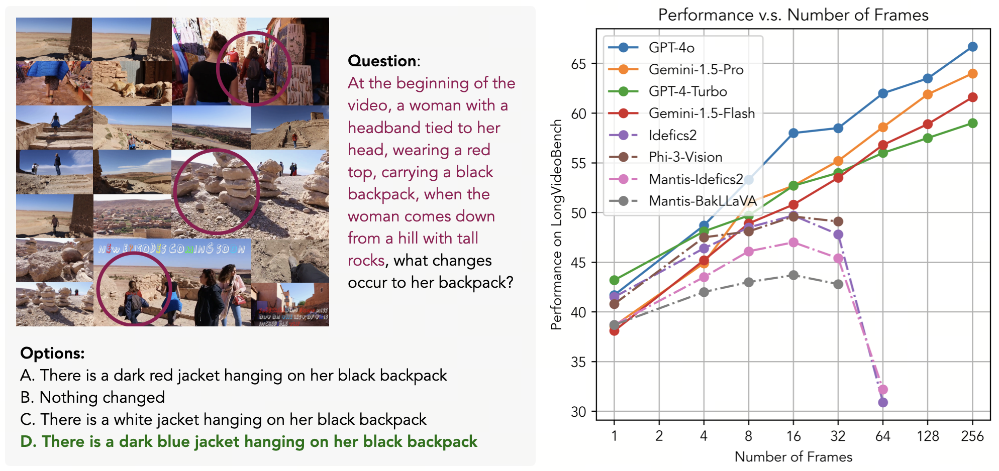
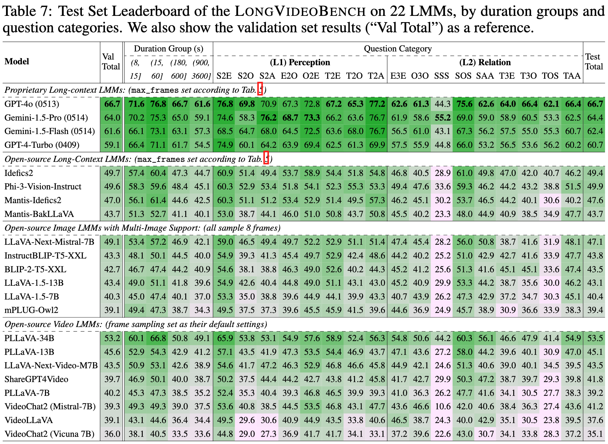

<div align="center">
  <h1>LongVideoBench: A Benchmark for Long-context Interleaved Video-Language Understanding</h1> 
  
    
<div style="width: 35%; text-align: center; margin:auto;">
      
</div> 

  <div>
      <a href="https://scholar.google.com.hk/citations?user=wth-VbMAAAAJ" target="_blank">Haoning Wu</a>,
      <a href="https://scholar.google.com/citations?user=h5XtaUUAAAAJ" target="_blank">Dongxu Li</a>,
    <a href="https://scholar.google.com/citations?user=Po65v_MAAAAJ" target="_blank">Bei Chen</a>,
    <a href="https://scholar.google.com/citations?user=MuUhwi0AAAAJ" target="_blank">Junnan Li</a>
</div>


    
<div>
   <a href="https://HuggingFace.co/datasets/longvideobench/LongVideoBench"><strong>Dataset on HuggingFace</strong></a>  | <a href="https://longvideobench.github.io/"><strong>Homepage</strong></a> | <a href="https://huggingface.co/spaces/longvideobench/LongVideoBench"><strong>HuggingFace Leaderboard</strong></a> |  <a href="https://arxiv.org/abs/2407.15754"><strong>ArXiv</strong></a>
   </div>   
    
    
    
<h2>Introduction</h2> 
(left) An referring reasoning question. (right) Results with different input frames.
<div style="width: 80%; text-align: center; margin:auto;">
      
</div> 

<h2>Initial Leaderboard</h2> 

View more on <a href="https://huggingface.co/spaces/longvideobench/LongVideoBench"><strong>HuggingFace Leaderboard</strong></a>.

<div style="width: 80%; text-align: center; margin:auto;">
      
</div>


</div> 

## [Custom Use] Load the LongVideoBench Dataset

1. Download the dataset via Hugging Face CLI:

```shell
huggingface-cli download longvideobench/LongVideoBench --repo-type dataset --local-dir LongVideoBench --local-dir-use-symlinks False
```

2. Extract from the `.tar` files:

```shell
cat videos.tar.part.* > videos.tar
tar -xvf videos.tar
tar -xvf subtitles.tar
```

3. Use the [LongVideoBench] dataloader to load the data from raw MP4 files and subtitles:

- (a) Install the dataloader:

```shell
git clone https://github.com/LongVideoBench/LongVideoBench.git
cd LongVideoBench
pip install -e .
```
- (b) Load the dataset in python scripts:

```python
from longvideobench import LongVideoBenchDataset

# validation
dataset = LongVideoBenchDataset(YOUR_DATA_PATH, "lvb_val.json", max_num_frames=64)

# test
dataset = LongVideoBenchDataset(YOUR_DATA_PATH, "lvb_test_wo_gt.json", max_num_frames=64)

print(dataset[0]["inputs"]) # A list consisting of PIL.Image and strings.
```

The "inputs" are interleaved video frames and text subtitles, followed by questions and option prompts. You can then convert them to the format that your LMMs can accept.

## [Automatic] Evaluating with LMMs-Eval

LongVideoBench has been integrated into [LMMs-Eval](https://github.com/EvolvingLMMs-Lab/lmms-eval) library for automatic evaluation. With datasets and models on Hugging Face, you and can start automatic evaluation once the LMMs-Eval library is properly installed. 

### Install

Please install LMMs-Eval as follows:

```
git clone https://github.com/EvolvingLMMs-Lab/lmms-eval
cd lmms-eval
pip install -e .
```

This will install the GitHub main version that supports tasks: `longvideobench_val_i` (LongVideoBench for Image LMMs) and `longvideobenc_val_v` (LongVideoBench for Video-specific LMMs).

### Example Use (Image LMMs)

We feed 16 frames by default for Image LMMs. To modify this, please go to `lmms_eval/tasks/longvideobench/utils.py` and change the parameter `max_num_frames` to other values (e.g. 4, 8, or 32, or even 64, 128, 256 for proprietary models).

- Idefics2

```
python3 -m accelerate.commands.launch --num_processes=8 -m lmms_eval --model idefics2 --tasks longvideobench_val_i --batch_size 1 --log_samples --log_samples_suffix idefics2_lvb_i --output_path ./logs/
```

- Phi3V

```
python3 -m accelerate.commands.launch --num_processes=8 -m lmms_eval --model phi3v --tasks longvideobench_val_i --batch_size 1 --log_samples --log_samples_suffix phi3v_lvb_i --output_path ./logs/
```

### Example Use (Video-specific LMMs)

- LLaVA-NeXT-Video-34B-DPO

(32 frames)

```
python3 -m accelerate.commands.launch --num_processes=8 -m lmms_eval --model llavavid --model_args pretrained="lmms-lab/LLaVA-NeXT-Video-34B-DPO",max_frames_num=32,conv_template=chatml_direct,video_decode_backend="decord" --tasks longvideobench_val_v --batch_size 1 --log_samples --log_samples_suffix llavavid_34b_dpo_lvb_v --output_path ./logs/
```

- LLaVA-NeXT-Video-7B-DPO

(32 frames)

```
python3 -m accelerate.commands.launch --num_processes=8 -m lmms_eval --model llavavid --model_args pretrained="lmms-lab/LLaVA-NeXT-Video-7B-DPO",max_frames_num=32,video_decode_backend="decord" --tasks longvideobench_val_v --batch_size 1 --log_samples --log_samples_suffix llavavid_7b_dpo_lvb_v --output_path ./logs/
```

- Video-LLaVA

(8 frames)

```
python3 -m accelerate.commands.launch --num_processes=8 -m lmms_eval --model video_llava --tasks longvideobench_val_v --batch_size 1 --log_samples --log_samples_suffix video_llava_lvb_v --output_path ./logs/
```


## Contact

Please contact `haoning001@e.ntu.edu.sg` for any queries.

## License

This dataset follows CC-BY-NC-SA 4.0 license. Please use this dataset for non-commercial use ONLY.

## Citation

```bibtex
@misc{wu2024longvideobench,
      title={LongVideoBench: A Benchmark for Long-context Interleaved Video-Language Understanding}, 
      author={Haoning Wu and Dongxu Li and Bei Chen and Junnan Li},
      year={2024},
      eprint={2407.15754},
      archivePrefix={arXiv},
      primaryClass={cs.CV},
      url={https://arxiv.org/abs/2407.15754}, 
}
```